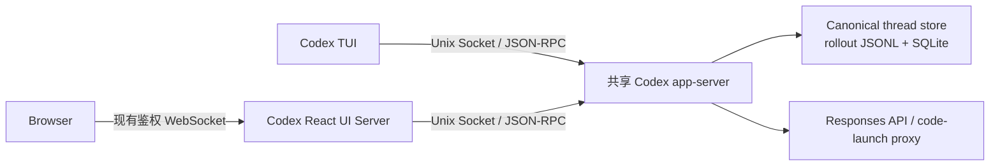
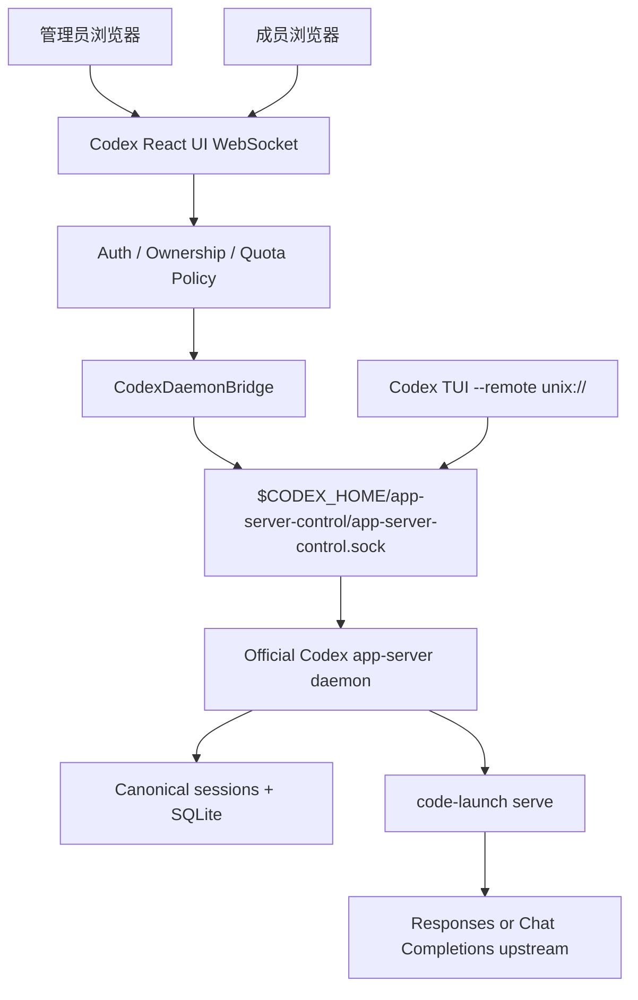

# Codex TUI 与 Web 实时双向同步改进计划

> 状态：统一可恢复历史阶段已完成实施；共享 Daemon 传输与订阅主路径已落地（默认 `daemon`）；双端 live 验收与 code-launch proxy-only 生产形态仍在进行
> 目标仓库：`/root/projects/codex-react-ui`  
> 协同仓库：`/root/projects/code-launch`  
> Codex 参考源码：`/root/projects/codex`  
> 当前已验证 CLI：`codex-cli 0.145.0`

## 1. 结论摘要

### 1.1 已落地基础：统一 Web 与 TUI 可恢复历史 (Unified Resumable History)

- **物理存储共用**：Web 与真实 TUI 的完整会话均归属于 Codex Canonical Thread Store（`sessions/rollout-*.jsonl` 与 SQLite 索引），二者格式完全一致且原生兼容。
- **架构清理**：彻底删除了“Web history / TUI history”双页签、只读 prompt transcript 弹窗以及 `/api/engine-history` 主机文件扫描引擎（`engineHistory.ts`、`engineHistoryWorker.ts` 等），不伪造 TUI 文件，也不将 `~/.codex/history.jsonl`（仅供 TUI 输入框 `Up`/`Down` 提示词回溯）混用为会话恢复。
- **统一加载与过滤**：侧栏历史统一通过 Codex 官方 JSON-RPC `thread/list` 协议动态加载：
  - 默认包含来源 `sourceKinds: ["cli", "vscode"]`，实现 Web（`vscode`）与终端 TUI（`cli`）创建的完整会话双向共享与实时恢复。
  - 开启“包含自动化会话”设置（`includeAutomationHistory`，默认 `false`）后增加 `["exec", "appServer"]`。
  - 始终过滤并排除 `subagent`（含 `parentThreadId`）和 `unknown` 来源会话。
- **功能完整继承**：统一侧栏保留各来源 Badge 标识、全局搜索、`thread/resume` 恢复、改名、归档与删除功能，并严格遵守 `thread_owners` ACL 权限隔离规则。

### 1.2 阶段二目标：共享 Daemon 实时双向同步

基于已统一的可恢复历史，可以实现以下完整实时同步体验：

- TUI 正在执行回合时，Web 打开同一 thread，立即获得完整历史、当前活动 turn 快照和后续实时增量。
- TUI 与 Web 同时显示 agent 文本、reasoning、命令输出、工具调用、审批请求、token usage 和完成状态。
- thread 空闲时，任一端可以发起下一回合。
- thread 正在运行时，另一端可以通过 `turn/steer` 追加指令，或通过 `turn/interrupt` 中断。
- 任一端完成审批后，另一端收到 `serverRequest/resolved` 并关闭重复审批界面。
- Web 或 TUI 断线重连后，通过 `thread/resume` 恢复活动快照并继续订阅，不依赖扫描或改写 rollout 文件。

实现关键不是“同步两个历史文件”，而是让 TUI 和 Web 成为**同一个 app-server 进程的两个客户端**：



`code-launch` 不能单独完成 thread 共享，因为它只负责模型协议代理，并且当前默认会为每次调用启动一个新的 Codex 进程。不过它可以加速落地：当前 `main.py` 会把参数原样传给 Codex，因此可以用它启动共享 app-server，而不是启动独立 TUI：

```bash
/root/projects/code-launch/main.py app-server --listen unix://
```

此命令的实际进程关系为：

```text
code-launch main.py
├── 本地 Responses/Chat Completions 转换代理
└── codex app-server --listen unix://
    ├── Codex TUI 客户端
    └── codex-react-ui 服务端客户端
```

这是最快的技术验证路径；生产目标仍应把 `code-launch` 代理和官方 app-server daemon 生命周期分离。

## 2. 当前状态与根因

### 2.1 当前 Web 运行方式

`apps/server/src/codexBridge.ts` 当前执行：

```text
codex app-server --stdio
```

这个子进程只与 `codex-react-ui` 服务端存在一条 stdio JSON-RPC 连接。浏览器收到的实时通知，全部来自这个私有 app-server 进程。

### 2.2 当前 TUI 运行方式

Codex TUI 会使用嵌入式 app-server，或在默认 daemon Unix Socket 已存在且启动参数兼容时连接本地 daemon。TUI 自己的活动 turn、订阅表、待审批请求和增量事件都属于它所连接的 app-server 进程。

### 2.3 为什么现在只能“结束后续接”

两个进程可以共享：

- `CODEX_HOME/sessions/**/rollout-*.jsonl`
- Codex SQLite thread index
- thread 名称、归档状态和已持久化 turn

但不会共享：

- 活动 `CodexThread` 内存对象
- 当前 turn 的尚未落盘增量
- app-server connection subscription
- 待处理 approval/server request callback
- `turn/steer`、`turn/interrupt` 所需的活动 turn 句柄

因此独立进程只能读取已经持久化的结果，无法跨进程广播正在生成的事件。

### 2.4 Codex 已提供的原生能力

当前 Codex 源码和已安装的 `0.145.0` 已具备所需基础：

- `codex app-server --listen unix://`
- `codex app-server daemon start/restart/stop/version`
- TUI `--remote unix://` 参数
- 同一 app-server 的多 connection 支持
- `thread/resume` 对运行中 thread 的“历史快照 + 原子订阅”
- thread-scoped notification 向所有订阅 connection 广播
- `thread/unsubscribe`
- `turn/steer`、`turn/interrupt`
- 新 connection 加入运行中 thread 时重放待处理 server requests
- 一个 request 被处理后向订阅者发送 `serverRequest/resolved`

对应的上游实现依据包括：

- `codex-rs/app-server/src/thread_state.rs`
- `codex-rs/app-server/src/request_processors/thread_processor.rs`
- `codex-rs/app-server/src/request_processors/thread_lifecycle.rs`
- `codex-rs/app-server/src/outgoing_message.rs`
- `codex-rs/tui/src/lib.rs`
- `codex-rs/app-server/README.md`

## 3. `code-launch` 研究结论

### 3.1 它当前做什么

`/root/projects/code-launch/main.py` 的职责是：

1. 从 `.env` 或环境变量加载上游 URL、模型和 API Key。
2. 在 `127.0.0.1` 动态或固定端口启动 `ThreadingHTTPServer`。
3. 把 Codex Responses API 请求直传或转换成 Chat Completions。
4. 把上游 SSE 转回 Codex 能消费的 Responses SSE。
5. 给 Codex 注入 `model_provider=code_launch` 和本地 proxy `base_url`。
6. 通过 `subprocess.run([CODE_BIN, *args])` 启动一个 Codex 子进程。
7. Codex 子进程退出后关闭 proxy。

它不实现：

- app-server JSON-RPC
- thread/list、thread/resume 或 turn/start
- canonical thread 存储
- connection subscription
- 跨客户端事件广播
- Web/TUI 权限与 ownership

所以“同时运行 code-launch”本身不会让现有两个 app-server 实时同步。

### 3.2 为什么当前 `code-launch` 启动 TUI 反而不利于共享

`main.py` 会给每次 Codex 调用注入多个 `-c` 配置覆盖。Codex TUI 只有在没有此类不可重放启动覆盖时才会自动复用默认本地 daemon；因此直接执行：

```bash
code-launch
```

通常会创建一个新的 TUI/嵌入式 app-server，而不是连接 Web 使用的共享 runtime。

即使追加 `--remote unix://`，这些只存在于 TUI 启动命令中的 provider 覆盖也不能可靠传入已经运行的远端 daemon。共享 daemon 必须自己持有 provider 配置。

### 3.3 可立即利用的快速路径

`main.py` 把未知参数直接转交给 Codex，因此下面的调用无需先修改 `code-launch`：

```bash
CODE_BIN=/root/.local/bin/codex \
  /root/projects/code-launch/main.py app-server --listen unix://
```

它会：

- 启动 code-launch 模型代理。
- 把代理地址作为 `code_launch` provider 注入 Codex。
- 启动一个监听默认 Unix Socket 的 app-server。
- 保持代理存活直到 app-server 退出。

随后：

```bash
codex --remote unix://
```

即可让 TUI 连接这个 app-server。Web 服务端也连接相同 Socket，便可验证实时双向同步。

### 3.4 快速路径的限制

该方式适合作为 P0 spike，不应直接作为最终生产架构：

- app-server 生命周期由 `main.py` 的前台父进程间接管理，不进入官方 daemon pidfile 管理。
- `main.py` 没有完整的 SIGTERM/SIGINT 子进程组转发，异常退出可能遗留 child 或 socket。
- code-launch proxy 重启会连带终止共享 app-server，使 TUI 和 Web 同时断线。
- proxy 没有独立 `/readyz`、结构化 ready 输出或稳定的监督协议。
- verbose 日志会输出 API Key 前缀和完整 SSE chunk，不适合作为长期服务日志。
- 普通 `codex app-server daemon version/stop` 不能可靠管理这个由 code-launch 启动的进程树。

### 3.5 生产推荐

给 `code-launch` 增加兼容的 proxy-only 模式：

```bash
code-launch serve --host 127.0.0.1 --port 43111 --json
```

要求：

- 只启动模型转换代理，不启动 Codex CLI。
- 提供 `/healthz` 和 `/readyz`。
- 启动成功后输出单行 JSON，包括 host、port、wire API 和 PID，但不包含密钥。
- 正确处理 SIGINT/SIGTERM，停止接受新请求并等待活动请求结束。
- 日志永不打印 API Key、Authorization、完整 prompt 或完整 SSE payload。
- 保持现有 `code-launch [codex args...]` 行为向后兼容。

共享 app-server 使用官方 daemon 独立运行，并把 `model_providers.code_launch.base_url` 指向该固定 loopback proxy。这样重启/切换代理密钥不会中断 thread event hub。

## 4. 目标与非目标

### 4.1 目标

- 一个 OS 用户、一个 `CODEX_HOME` 下只有一个交互式共享 app-server runtime。
- Web 和 TUI 对同一 thread 获得一致的历史、活动状态与实时事件。
- Web 能安全执行 start、steer、interrupt 和 approval response。
- TUI 能立即渲染 Web 发起的回合和操作结果。
- 断线和进程重启不会损坏 rollout，也不会产生重复 turn。
- 保留 Web 的成员权限、并发限制、余额和危险权限审计。
- 保留 canonical history 单列表，不重新引入 `history.jsonl` 扫描。
- code-launch 仅作为模型传输层，不能成为 thread 状态真相来源。

### 4.2 非目标

- 不同步输入草稿、光标、滚动位置、面板展开状态等纯 UI 状态。
- 不允许同一 thread 同时存在两个独立活动 turn。
- 不通过 tail/follow rollout JSONL 模拟实时事件。
- 不手工写 Codex SQLite、rollout 或 `~/.codex/history.jsonl`。
- 不让浏览器直接连接 app-server Unix Socket。
- 第一版不支持跨主机 Unix Socket；远程主机另行使用安全的 remote app-server transport。
- 不修改 Codex 上游协议；仅消费当前已有接口。

## 5. 最终架构

### 5.1 进程边界



### 5.2 单一权威

| 数据或状态 | 唯一权威 |
| --- | --- |
| thread/turn/item 历史 | Codex canonical thread store |
| 活动 turn 和 event stream | 共享 app-server 内存 |
| pending approval callback | 共享 app-server |
| 模型协议转换与上游 key rotation | code-launch proxy |
| Web 成员可见性 | `thread_owners` / `AuthStore` |
| 浏览器 UI 状态 | 各浏览器本地状态 |

### 5.3 传输选择

生产版本使用官方默认 Unix Socket：

```text
$CODEX_HOME/app-server-control/app-server-control.sock
```

选择理由：

- 仅本机可访问。
- 不开放 TCP 端口。
- TUI 已支持 `--remote unix://`，并能在条件满足时自动探测默认 socket。
- 一个 app-server 可接受多个 WebSocket-over-Unix connection。
- 与官方 daemon lifecycle 对齐。

Web 服务端新增 `ws` 依赖，通过 `node:net.connect({ path: socketPath })` 提供自定义 connection，完成 Unix Socket 上的 WebSocket HTTP Upgrade。每个 frame 承载一个 app-server JSON-RPC message，不再使用 stdio JSONL parser。

## 6. Runtime 生命周期设计

### 6.1 运行模式

新增环境变量：

```text
CODEX_UI_APP_SERVER_MODE=daemon|stdio
```

- 第一阶段默认 `stdio`，`daemon` 为 opt-in。
- 完成稳定性验收后默认切换为 `daemon`。
- `stdio` 保留为紧急回滚模式，但明确标记“不支持实时 TUI 同步”。

v1 只连接当前 `CODEX_HOME` 对应的官方默认 socket，不支持任意自定义 socket 路径，降低路径劫持和配置分叉风险。

### 6.2 服务端启动顺序

daemon 模式启动步骤固定为：

1. 初始化 `LocalDatabase`、`ProviderStore`、`AuthStore`。
2. 解析与当前 Web 服务相同的 `CODEX_HOME`。
3. 运行只读能力探测：Codex 版本、daemon 子命令、`--remote` 和 Unix listener。
4. 如果使用 code-launch，先确保 proxy ready。
5. 调用 `codex app-server daemon version` 探测现有 runtime。
6. 若未运行，则以当前安全环境启动 `codex app-server daemon start`。
7. 等待 socket ready，默认上限 10 秒。
8. Web 建立 Unix WebSocket connection。
9. 每条 connection 独立执行 `initialize` 和 `initialized`。
10. 发布扩展后的 `engine.status`，随后接受浏览器 RPC。

Web 服务停止时不停止共享 daemon，因为 TUI 可能仍在使用。只有显式的管理员“停止共享 runtime”操作才允许执行 daemon stop。

### 6.3 TUI 启动规则

可靠启动方式：

```bash
codex --remote unix://
```

如果默认 daemon 已先启动，且 TUI 没有 `-c`、strict config 或其他不可重放覆盖，普通 `codex` 也会自动探测 socket。文档和 Web 状态面板仍以显式 `--remote unix://` 作为可验证方式。

已经运行在 embedded 模式中的 TUI 无法在活动 turn 中途迁移到另一个 app-server。此时 Web 只能等该 turn 持久化后恢复。要获得实时同步，TUI 必须从启动时连接共享 daemon。

### 6.4 版本与能力探测

不只根据版本号判断。连接后直接验证：

- `thread/loaded/list`
- `thread/resume`
- `thread/unsubscribe`
- `turn/steer`
- `turn/interrupt`
- `serverRequest/resolved` notification 支持

缺少必需方法时：

- daemon mode 标记为 `degraded`。
- 禁用相应 Web 操作。
- 提示升级 Codex。
- 不自动回退到另一个独立 app-server，以免用户误以为仍是实时共享。

## 7. code-launch 与 Provider 生命周期

### 7.1 最终职责分离

```text
code-launch serve
  └── 只保存/读取上游 API Key，提供本地 Responses endpoint

codex app-server daemon
  └── 只配置 http://127.0.0.1:43111/v1，不持有上游 API Key
```

这比把 Web key 注入 app-server daemon 环境更安全，也避免每次换 key 都重启共享 thread runtime。

### 7.2 code-launch 监督

新增 `CodeLaunchSupervisor`，职责为：

- 仅在激活 `code_launch` provider 时启动 proxy-only 进程。
- 固定绑定 `127.0.0.1`，拒绝 `0.0.0.0`。
- 从 Web keyring/内存或 code-launch `.env` 提供密钥；绝不写入 Codex config。
- 读取结构化 ready JSON，验证 PID 和端口。
- 失败后指数退避重启，最大间隔 30 秒。
- 向 Web 报告 `starting/ready/degraded/error`。
- Web 退出时可根据部署模式选择保留外部服务，或终止由当前进程启动的临时 proxy。

生产部署优先使用 user systemd/独立进程监督，使 Web 停止时 TUI 仍能调用模型。开发模式允许由 Web 临时监督。

### 7.3 Provider 配置写入

通过 app-server `config/batchWrite` 持久化非敏感配置：

```toml
[model_providers.code_launch]
name = "code-launch proxy"
base_url = "http://127.0.0.1:43111/v1"
wire_api = "responses"
```

不设置 `env_key`，因为 Authorization 由 code-launch 加到上游请求。

### 7.4 切换与故障语义

- 切换模型或已有 provider：只更新 app-server config，不重启 daemon。
- 更新 code-launch API Key：只重启/热更新 proxy，不重启 daemon。
- proxy 暂时不可用：当前 model turn 失败，但 thread runtime 和其他 provider thread 保持在线。
- 删除 provider：先从 app-server config 移除，再停止 proxy 并删除 keyring secret。
- verbose 日志默认关闭；即使开启也不能打印 key 前缀、请求正文或完整 SSE chunk。

## 8. Web 与 app-server 连接设计

### 8.1 Bridge 接口保持兼容

把当前 `CodexBridge` 抽象为统一接口：

```ts
interface CodexRuntimeClient {
  start(): Promise<EngineStatus>;
  stop(): void;
  restart(): Promise<EngineStatus>;
  request(method: string, params?: JsonValue, timeoutMs?: number): Promise<JsonValue>;
  notify(method: string, params?: JsonValue): Promise<void>;
  respond(id: JsonRpcId, result?: JsonValue, error?: JsonRpcFailure["error"]): void;
}
```

实现：

- `StdioCodexBridge`：现有逻辑，作为回滚兼容。
- `DaemonCodexBridge`：Unix WebSocket、多次重连、connection epoch 和订阅恢复。

业务层继续使用同一 `request/notify/respond` 接口，避免一次性重写全部 RPC 调用。

### 8.2 Connection 状态

扩展 `EngineStatus`：

```ts
type EngineStatus = {
  phase: "idle" | "starting" | "ready" | "reconnecting" | "degraded" | "error" | "stopped";
  transport?: "stdio" | "daemon-unix";
  realtimeSync?: "available" | "degraded" | "unavailable";
  connectionEpoch?: number;
  daemonPid?: number;
  codexVersion?: string;
  codexHome?: string;
  message?: string;
};
```

普通成员只看到状态和可用性；socket path、PID 和诊断详情仅管理员可见。

### 8.3 重连策略

- 初次失败：250ms 后重试。
- 指数退避到 10 秒，加入 jitter。
- socket 关闭时立即拒绝所有未完成 RPC，并返回明确的 retriable error。
- 新连接成功后重新 initialize，`connectionEpoch += 1`。
- 保留逻辑 watcher registry，并重新 resume 需要监看的 thread。
- 不重放旧 delta；用新的活动 turn snapshot 替换本地活动状态，再消费新 epoch 的增量。
- 浏览器收到 reconnect 状态时禁止发送，直到对应 thread reattached。

## 9. Thread 订阅与事件顺序

### 9.1 为什么需要 Web 侧 watcher registry

app-server 的订阅单位是 connection，而 Web 服务端会把多个浏览器复用到一个 app-server connection。如果任一浏览器 resume 过一个 thread，bridge 就会持续订阅；若永不 unsubscribe，daemon 会永久保留大量 loaded thread。

新增 `ThreadSubscriptionRegistry`：

```text
threadId
├── browserWatchers: Set<webSocketConnectionId>
├── activeTurnHolds: Set<turnId>
├── ownerUserId
├── upstreamSubscribed: boolean
└── connectionEpoch
```

规则：

- `thread/start` 或 `thread/resume` 成功后为调用浏览器增加 watcher。
- 主聊天、任务 tab 和 sidechat tab 关闭时发送 `thread.unwatch`。
- 浏览器 WebSocket 断开时删除它的全部 watcher。
- Web 发起 turn 后增加 `activeTurnHold`；收到 terminal notification 后释放。
- 只有 watcher 和 active hold 都为空时才向 app-server 发送 `thread/unsubscribe`。
- app-server connection 重连后，只 reattach registry 中仍有 watcher/hold 的 thread。

### 9.2 新增浏览器控制消息

```ts
type ThreadWatchMessage = {
  type: "thread.watch";
  threadId: string;
};

type ThreadUnwatchMessage = {
  type: "thread.unwatch";
  threadId: string;
};
```

这两个消息只管理 Web 到 app-server 的订阅引用，不改变 canonical thread 内容。

### 9.3 Resume 顺序屏障

上游 app-server 能保证“运行中历史快照 + 订阅”原子性，但 Web bridge 还必须保证浏览器先应用 resume snapshot，再应用后续 delta。

每个 thread 设置 resume barrier：

1. 标记 thread 为 `hydrating`。
2. 向 daemon 发送 `thread/resume`。
3. 暂存该 thread 在 resume response 之后到达的 notifications。
4. 先把 RPC result 发给请求浏览器并完成 reducer hydration。
5. 再按接收顺序 flush 暂存 notifications。
6. 标记为 `live`。

若 hydration 失败，丢弃本次 barrier buffer，并要求客户端重新 resume；不能把无基线 delta 直接应用到旧 transcript。

### 9.4 Event identity 与去重

- 新 Web turn 必须传唯一 `clientUserMessageId`。
- optimistic user message 按 client ID 与服务端 item 合并。
- completed item 按 `threadId + turnId + itemId` 幂等更新。
- terminal turn 按 `threadId + turnId` 幂等处理。
- delta 只在当前 `connectionEpoch` 内按顺序应用；跨 epoch 不尝试文本级去重。
- 重连时以 resume snapshot 为基线，避免重复拼接旧 delta。

## 10. 双端操作语义

### 10.1 状态机

| Thread 状态 | Web composer 行为 | RPC |
| --- | --- | --- |
| idle | 正常“发送” | `turn/start` |
| active regular turn | 显示“追加指令” | `turn/steer` + `expectedTurnId` |
| active review/compact | 禁止直接输入并显示原因 | 无 |
| direct input blocked | 禁止输入 | 无 |
| reconnecting/hydrating | 临时禁用发送 | 无 |
| active turn 可中断 | 显示 Stop | `turn/interrupt` |

前端不能再假设活动 turn 一定由当前浏览器发起。所有运行状态必须以 daemon snapshot/notification 为准。

### 10.2 同时发送

- idle 状态下两端可能几乎同时调用 `turn/start`。
- 服务端以第一个成功创建的 active turn 为准。
- 后到请求若发现 active turn，Web 不自动重试为另一个 turn；刷新状态后允许用户明确选择 steer。
- 不能静默把两个独立用户消息合并，避免改变用户意图。

### 10.3 Steering

- 活动 turn 必须携带当前 `expectedTurnId`。
- turn 已结束或 ID 已变化时，服务端拒绝 steering。
- Web 收到 mismatch 后刷新 thread snapshot，并把未发送文本保留在 composer 中。
- review 和 manual compaction turn 不支持 steer，UI 预先禁用。

### 10.4 Interrupt

- interrupt 以 `(threadId, turnId)` 为目标。
- 任一端中断成功后，两端等待统一的 terminal notification。
- 重复 interrupt 被视为无害竞态，UI 不伪造第二个完成状态。

## 11. Approval 与 Server Request

### 11.1 实时加入

Web resume 一个正在等待审批的 thread 时，app-server 会向新 connection 重放 pending server requests。Web 必须在 resume snapshot hydration 后展示这些请求。

### 11.2 多端竞态

- TUI 和 Web 都可能看到同一 request ID。
- 任一端成功响应后，app-server 消费 callback。
- 所有订阅端收到 `serverRequest/resolved`。
- 另一端立即关闭对应审批 UI。
- 迟到响应若返回 unknown/already resolved，应显示为已由其他客户端处理，而不是通用失败。

### 11.3 Web 路由安全修正

当前 Web 对 `codex.serverRequest` 的广播需要改为 thread-aware 路由：

- 从 request params 提取 `threadId`。
- 管理员可接收主机范围 thread 请求。
- 普通成员只有在 `thread_owners` 确认 ownership 后才能接收和响应。
- 无法解析 threadId 的危险请求默认只发管理员，不能广播所有成员。
- server response 进入 bridge 前再次校验 request 与 user/thread 的绑定。

## 12. 权限与可见性

### 12.1 可见性矩阵

| 场景 | 管理员/单用户 | 普通 Web 成员 | 本地 TUI |
| --- | --- | --- | --- |
| Web 创建的 own thread | 可见 | owner 可见 | OS 用户可见 |
| TUI 创建、未分配 owner | 可见 | 不可见 | 可见 |
| 其他成员 Web thread | 可见 | 不可见 | OS 用户可见 |
| subagent thread | 默认历史列表隐藏 | 隐藏 | 由 TUI 规则决定 |

### 12.2 Ownership 规则

- Web `thread/start` 成功后立即 `claimThread(threadId, userId)`。
- 普通成员不能仅通过猜测 thread ID resume TUI thread。
- 管理员打开 TUI thread 不自动把它绑定到管理员账号。
- 若未来需要成员接管 TUI thread，必须增加显式管理员 assignment 流程，不能自动 claim。
- TUI 不理解 Web ACL；这是同 OS 用户信任边界的固有限制，README 必须明确。

### 12.3 现有策略不能绕过

共享 daemon 模式下仍须在 Web server 转发前执行：

- cwd clamp
- permission ceiling
- dangerous permission audit
- per-user concurrency
- balance debit
- thread ownership
- provider allowlist

切换 transport 不能把这些检查下沉后遗漏。

## 13. Unix Socket 与密钥安全

- 浏览器永不获得 socket path 或 app-server capability。
- 默认只接受当前 `CODEX_HOME` 推导出的官方 socket。
- 连接前验证 socket 不是普通文件，且 owner UID 与 Web 进程一致。
- 拒绝 group/world writable 的异常 socket 或父目录。
- 不在 loopback TCP 暴露 app-server。
- Web session token 与 app-server transport 完全分层。
- code-launch 仅绑定 `127.0.0.1`。
- API Key 只进入 code-launch 进程环境/内存或 OS keyring。
- 日志、错误、ready JSON 和数据库不能包含 secret、Authorization 或完整 prompt。
- `CODE_LAUNCH_VERBOSE` 的现有 key 前缀与 chunk 输出必须在服务化前移除。

## 14. Web UI 改进

### 14.1 历史侧栏（已完成基础重构）

- **统一单列表**：已移除原有的 `Web / TUI` 双 Tab、只读 prompt transcript 弹窗与后端 `/api/engine-history` 文件扫描引擎。
- **动态来源过滤**：侧栏直接通过 `thread/list` 加载，默认加载 `sourceKinds: ["cli", "vscode"]`，开启 `includeAutomationHistory` 配置时增加 `["exec", "appServer"]`。
- **保留完整会话管理**：保留会话来源标识 Badge（`Cli` / `VSCode` / `Exec` / `AppServer`）、全局搜索、`thread/resume` 恢复、重命名、归档和删除功能。
- **后续状态扩展**：在共享 Daemon 架构落地后，进一步显示 `Idle`、`Running`、`Waiting approval`、`Reconnecting` 状态 chip。

### 14.2 Transcript

- resume response 先完整 hydrate。
- 活动 turn item 与后续 delta 在原位置继续增长。
- 外部客户端发起的 user message 不使用本地 optimistic ID，直接按服务端 item 渲染。
- 显示轻量 origin 标识：`TUI`、`Web` 或 `Other client`；来源不影响 canonical 内容。

### 14.3 Composer

- idle：发送新 turn。
- active：切换为 steer 语义，并明确文案“追加到当前回合”。
- reconnecting/hydrating：保留草稿但禁用提交。
- steer mismatch：保留草稿并提示活动 turn 已变化。
- direct input blocked：显示 app-server 返回的能力原因。

### 14.4 Runtime 状态面板

管理员设置页显示：

- app-server mode
- realtime availability
- daemon version/PID
- connection epoch
- code-launch proxy health
- 当前 loaded/active thread 数量
- 推荐 TUI 命令 `codex --remote unix://`
- “重新连接”操作
- 在确认无活动 turn 后可执行的“重启共享 runtime”操作

## 15. 实施分解

### Phase 0：无代码架构验证

目标：证明当前 Codex 与当前 code-launch 可以完成双 connection 实时流。

1. 使用隔离的临时 `CODEX_HOME`。
2. 配置 code-launch 测试上游。
3. 运行 `main.py app-server --listen unix://`。
4. 建立两个 app-server client，分别模拟 TUI 与 Web。
5. client A 创建 thread 并启动慢速 streaming turn。
6. client B 在 turn 中途 `thread/resume`。
7. 验证 B 获得活动 snapshot 和后续 delta。
8. B 调用 `turn/steer`，验证 A/B 同时收到结果。
9. 创建 approval，验证 pending request replay 和 resolved notification。
10. 保存证据日志，但对 prompt、key 和输出内容脱敏。

退出条件：无事件缺口、无第二份 rollout、同一 thread ID 双端一致。

### Phase 1：Daemon transport（功能开关）

在 `codex-react-ui` 中：

- 抽象 `CodexRuntimeClient`。
- 保留 `StdioCodexBridge`。
- 新增 `DaemonCodexBridge` 和 Unix WebSocket client。
- 新增 daemon lifecycle/capability probe。
- 扩展 `EngineStatus`。
- 添加 reconnect 与 RPC failure 语义。
- 使用 `CODEX_UI_APP_SERVER_MODE=daemon` opt-in。

退出条件：现有 Web 单客户端所有功能在 daemon transport 下通过，且 stdio fallback 不回归。

### Phase 2：订阅与实时 UI

- 实现 `ThreadSubscriptionRegistry`。
- 新增 browser watch/unwatch。
- 实现 resume barrier 和 connection epoch。
- 支持外部 active turn hydration。
- composer 根据状态选择 start/steer。
- 完成 interrupt 和 cross-client terminal handling。
- history/UI 增加实时状态提示。

退出条件：TUI 发起 turn、Web 中途加入并操作的完整场景通过。

### Phase 3：Approval 与权限加固

- serverRequest 按 thread ownership 路由。
- pending request replay 渲染。
- resolved 跨端清理。
- 重复响应竞态处理。
- 校验 concurrency、balance、cwd 和 permissions 在 daemon mode 不被绕过。

退出条件：普通成员无法看到或响应未分配 TUI thread 的请求。

### Phase 4：code-launch 服务化

在 `/root/projects/code-launch` 中：

- 新增向后兼容的 `serve`/proxy-only 子命令。
- 增加 health/ready 和 JSON ready 输出。
- 增加信号处理、请求 draining 和安全日志。
- 添加稳定 loopback port 配置。

在 `codex-react-ui` 中：

- 新增 `CodeLaunchSupervisor`。
- 将 provider 指向长期 proxy。
- 切换 key/model 不重启 app-server daemon。

退出条件：重启 code-launch 不会断开 TUI/Web app-server connection；恢复后新 turn 可继续。

### Phase 5：默认启用与清理

- 生产默认切换为 `daemon`。
- 保留 `stdio` 环境变量回滚。
- 更新 README、部署文档和中英文文案。
- 记录升级前置条件和 TUI 启动方式。
- 稳定两个版本周期后再评估是否删除 stdio bridge。

## 16. 预计代码改动

### codex-react-ui 服务端

- `apps/server/src/codexBridge.ts`：拆分接口与 stdio 实现。
- 新增 daemon transport/lifecycle、subscription registry 和 code-launch supervisor 模块。
- `apps/server/src/index.ts`：接入 transport 选择、watch lifecycle、权限路由和 reconnect。
- `apps/server/package.json`：增加 `ws`；开发依赖增加对应类型。
- 本地数据库新增非敏感 runtime state，用于记录 daemon PID、版本、connection generation 和 provider proxy 状态；不存 secret。

### codex-react-ui 前端与 shared

- 扩展 `EngineStatus` 和 WebSocket message union。
- `App.tsx` 支持外部 active turn、resume barrier 状态和 watch/unwatch。
- transcript reducer 增加 connection epoch 与 snapshot replacement。
- composer 增加 start/steer 状态机。
- 历史侧栏和设置页增加 realtime/runtime 状态。
- 更新中英文 locale、README 和 E2E fixtures。

### code-launch

- `main.py` 增加明确子命令解析，保留旧参数透传行为。
- proxy server 增加 health、ready、信号与结构化日志。
- 删除任何 key 前缀和完整 SSE/prompt 日志。
- 新增 proxy-only 生命周期测试和多并发请求测试。

## 17. 测试计划

### 17.1 单元测试

- daemon lifecycle JSON 解析与状态映射。
- Unix Socket path/owner/mode 验证。
- WebSocket handshake、initialize 和 frame parser。
- RPC timeout、断线 reject 和 reconnect backoff。
- subscription watcher/active hold 引用计数。
- socket close 时 watcher 清理。
- resume barrier 中 response-before-delta 顺序。
- connection epoch 切换时 snapshot replacement。
- start/steer/interrupt 状态机。
- serverRequest ownership 路由。
- provider proxy 配置不包含 API Key。
- 日志脱敏测试。

### 17.2 app-server 双客户端集成测试

使用临时 `CODEX_HOME` 和可控 mock Responses server：

1. client A start thread。
2. A start turn，mock server 分段延迟输出。
3. client B 在中间 resume。
4. B 的 resume response 包含 in-progress turn。
5. A/B 收到完全相同的后续 item delta 和 completed。
6. B steer，A/B 都看到 injected user input。
7. A interrupt，B 收到 interrupted terminal state。
8. B unsubscribe 后不再接收该 thread 新事件。
9. B 重连并 resume，状态恢复且不重复文本。

### 17.3 Approval 集成测试

- A 发起需要审批的命令。
- B 中途 resume 并收到 pending request replay。
- B 批准，A/B 收到 resolved。
- A 的迟到响应被识别为已处理。
- 非 owner Web 用户不收到请求，也不能伪造响应。

### 17.4 code-launch 测试

- `serve` ready/health。
- Responses direct forwarding。
- Responses ↔ Chat translation streaming。
- 多 thread 并发请求。
- 429/5xx retry 与 key rotation。
- SIGTERM draining。
- proxy 重启不影响 app-server connection。
- stdout/stderr 不出现 key、Authorization 或 prompt 内容。

### 17.5 Web E2E

- history 显示 TUI running thread。
- 点击后立即显示既有历史和活动输出。
- TUI 输出继续实时增长。
- Web steer 后两端可见。
- Web interrupt 后两端进入 terminal 状态。
- Web/TUI 分别处理 approval。
- 浏览器刷新后恢复活动 thread。
- daemon 短暂重启后 Web 显示 reconnecting 并恢复。
- 普通成员 visibility/ownership 不回归。
- stdio fallback 明确显示 realtime unavailable。

### 17.6 性能与稳定性

- 本地 app-server event 到浏览器渲染的中位延迟目标小于 100ms，P95 小于 250ms。
- 单连接至少覆盖 20 个 watched thread，不出现持续内存增长。
- 100,000 个 delta frame 压测不乱序、不阻塞 RPC response。
- 浏览器慢消费者触发有界队列策略，不拖垮 daemon connection。
- daemon 连续运行 24 小时，反复 TUI/Web attach/detach 后 loaded thread 能按规则卸载。

## 18. 故障模式与处理

| 故障 | 用户表现 | 系统处理 |
| --- | --- | --- |
| daemon 未运行 | Web starting | 自动 start，超时后给管理员诊断 |
| stale socket | 无法连接 | 使用官方 lifecycle 清理/重启，不直接删除未知 socket |
| daemon connection 丢失 | Reconnecting，composer 禁用 | reject in-flight RPC、重连、reattach |
| TUI 使用 embedded mode | 只能结束后续接 | 显示启动指令，不能伪装实时 |
| code-launch proxy down | model turn 失败 | daemon 保持在线，proxy 独立重启 |
| proxy key 失效 | 上游 401/402 | key rotation/冻结，返回脱敏错误 |
| 两端同时 start | 一个成功，一个竞态失败 | 刷新 active snapshot，不自动合并 |
| 两端同时 approval | 一个成功 | resolved 广播，迟到端显示已处理 |
| Web server 重启 | 浏览器短暂断线 | daemon/TUI turn 继续，Web 恢复后 resume |
| daemon 重启 | 两端断线 | Web 自动恢复；TUI 提示重新连接/重启 |
| 浏览器慢消费者 | UI 延迟 | 有界队列、丢弃可重建的状态通知，绝不丢 terminal/request |
| Codex API 不兼容 | Degraded | capability gate，禁用不支持操作 |

## 19. 发布、回滚与观测

### 19.1 发布顺序

1. 合入 daemon transport，但默认 stdio。
2. 开发/管理员环境启用 daemon。
3. 收集连接、重连、resume、steer、approval 指标。
4. 完成 code-launch proxy-only 后进行真实 provider soak。
5. 默认切换 daemon。

### 19.2 回滚

紧急回滚只需：

```text
CODEX_UI_APP_SERVER_MODE=stdio
```

回滚不会迁移或删除 canonical threads；仅失去活动回合实时共享。daemon 是否停止由管理员单独决定，不能由 Web 自动销毁。

### 19.3 指标

记录不含内容的指标：

- daemon connect/reconnect 次数与时长
- connection epoch
- watched/loaded/active thread 数
- resume latency 和 barrier buffer 深度
- event queue depth
- steer/interrupt 成功与竞态失败数
- pending approval replay/resolved 数
- code-launch health、upstream latency、429/5xx 数
- ownership 拒绝数

不得记录 prompt、assistant 内容、命令输出、API Key 或 Authorization。

## 20. 验收标准

### 20.1 统一可恢复历史（已完成）

- [x] Web 与 TUI 统一使用 Canonical Thread Store（`sessions/rollout-*.jsonl` 与 SQLite 索引）作为会话真实来源。
- [x] 删除了后端 `/api/engine-history` 扫描路由及 worker 文件（`engineHistory.ts` 等），不依赖或伪造 `~/.codex/history.jsonl`（仅供 TUI 提示词输入框回溯）。
- [x] 历史侧栏删除了双 Tab 与只读 transcript 弹窗，改为统一的 `thread/list` 恢复列表。
- [x] 侧栏默认过滤 `sourceKinds: ["cli", "vscode"]`；支持持久化设置 `includeAutomationHistory` 包含 `["exec", "appServer"]`。
- [x] 严格排除 `subagent`（`parentThreadId` 存在或来源包含 `subagent`）与 `unknown` 来源会话。
- [x] 遵守 `thread_owners` ACL 隔离模型：单用户/管理员可见 OS 用户全部规范会话；普通 Web 成员仅可见属于自身的会话。
- [x] 类型检查 (`typecheck`)、Lint、Build、服务器单元测试与 Playwright E2E 测试全部通过。

### 20.2 实时双向同步（进行中：主路径已落地）

- [x] Web 与 TUI 连接同一 app-server daemon，而非两个仅共享磁盘的进程（默认 `CODEX_UI_APP_SERVER_MODE=daemon` / Unix socket；stdio 仅调试降级）。
- [x] 服务端 `DaemonCodexBridge` + `ThreadSubscriptionRegistry`；浏览器通过既有鉴权 WS；引擎状态上报 `transport: daemon-unix` 与 `realtimeSync`。
- [x] 活动 thread 订阅/释放与 server 单元测试覆盖（`threadSubscriptionRegistry` / `codexBridge`）。
- [ ] TUI turn 进行中，Web resume 后无缺口地显示 snapshot 和后续 delta（端到端 soak）。
- [ ] Web 发起的 turn 在 TUI 中实时显示（端到端 soak）。
- [x] active turn 使用 `turn/steer` 追加输入路径已在 Web 侧接线（竞态与双端一致性仍需 soak）。
- [ ] interrupt 和 terminal 状态两端一致。
- [ ] pending approval 可在后加入端处理，resolved 会同步清理另一端。
- [ ] 浏览器刷新、Web server 重启后可以恢复活动 thread（生产场景验收）。
- [x] 非管理员无法读取或操作未分配的 TUI thread（`thread_owners` ACL 在历史与 RPC 门控中保留）。
- [ ] code-launch 仅作为模型 proxy，不承担 thread truth（生产 proxy-only 形态）。
- [ ] code-launch key 变更不要求重启共享 app-server。
- [x] 不修改 Codex rollout/SQLite 协议。

## 21. 明确采用的默认决策

- 实时同步层：共享 app-server daemon。
- 本地 transport：官方默认 Unix Socket。
- TUI 保证连接方式：`codex --remote unix://`。
- Web transport：服务端 WebSocket-over-Unix；浏览器不直连。
- 活动 turn 新输入：`turn/steer`，不自动创建并发 turn。
- 订阅释放：browser watcher + active turn hold 引用计数。
- 重连基线：重新 resume snapshot，不跨 epoch 重放 delta。
- 权限：管理员主机范围可见；普通成员保留 `thread_owners` 隔离。
- code-launch 快速验证：当前 `main.py app-server --listen unix://`。
- code-launch 生产形态：proxy-only 独立服务。
- secret 所有者：code-launch/keyring，不进入 Codex config 或日志。
- rollout、SQLite 和 Codex upstream protocol：不修改。
- 回滚：保留 stdio bridge，但明确为非实时模式。

