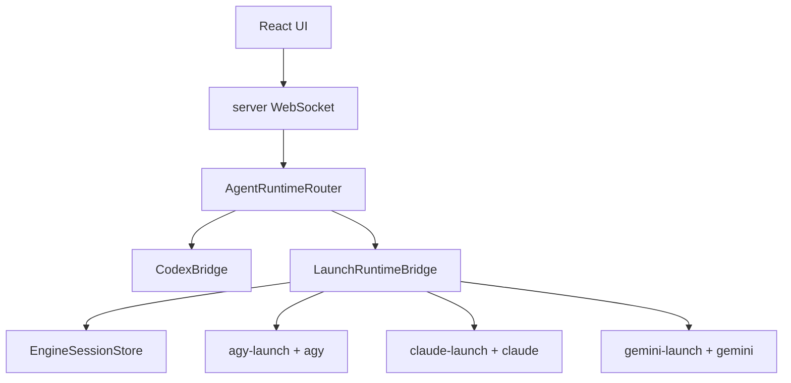

# codex-react-ui xxx-launch 联动任务计划

## 目标

把当前只读的多引擎历史视图升级为可交互 agent runtime：

- 新建 `agy` / `gemini` / `claude` / `crush` 等 agent 聊天
- 保存会话并在 UI 中继续会话
- UI 发送 prompt 后真实驱动对应 `xxx-launch` + 产品 CLI
- 保留当前 Codex 的 `thread/start` / `turn/start` 体验
- 非 Codex 引擎不再只是历史只读

## 当前状态

### 已有能力

- `packages/shared/src/agentEngines.ts`
  - 已有统一 engine catalog
  - 当前只有 Codex `resumeInUi/chatRuntime=true`
  - 其他引擎都是 `CAP_HISTORY_ONLY`

- `apps/server/src/engineHistory.ts`
  - 已能扫描各 CLI 本机历史
  - `listAgy()` 读 Antigravity metadata
  - `transcriptAgy()` 读 `history.jsonl`
  - 所有非 Codex 历史会被强制 `canResume=false`

- `apps/server/src/codexBridge.ts`
  - 只封装 Codex `app-server --stdio`
  - WebSocket `rpc` 直接转发给 Codex app-server

- `apps/web/src/App.tsx`
  - 主聊天通过 `thread/start` + `turn/start`
  - 侧边聊天也复用同一套 Codex RPC
  - 前端状态模型假设活跃 runtime 是 Codex

### agy-launch 关键发现

- `/root/projects/agy-launch/main.py`
  - 启动本地 HTTP proxy
  - 设置 `CLOUD_CODE_URL=http://127.0.0.1:<port>`
  - 再运行 `agy` 二进制
  - 翻译链路：`Google streamGenerateContent` -> OpenAI `/v1/chat/completions`
  - 目前是 TUI/CLI wrapper，不是 app-server 协议

关键点：

- `agy-launch` 本身不暴露 UI 友好的 JSON-RPC。
- 要让 UI 真实交互，不能只“读取历史文件”。
- 需要新增一个 `LaunchRuntimeBridge`，把 UI 消息送入对应 CLI，并把 CLI 输出归一化为 UI turn events。

## 深度评估结论

结论：方向正确，但原计划低估了 runtime 接入的“协议边界”和“安全边界”。这不是单纯把 `stdout` 接到 UI 的任务，而是要在现有 Codex app-server 强耦合架构旁边新增一个受控 runtime 子系统。

必须先修正的核心漏洞：

1. **新 RPC 名称会绕过现有会员保护**
   - 当前 `apps/server/src/index.ts` 的 cwd clamp、权限上限、并发、余额扣费、thread owner 都只识别 `thread/start` / `turn/start` 等 Codex 方法。
   - 如果直接新增 `agent/thread/start` / `agent/turn/start`，非 Codex runtime 会默认绕过安全和账务。
   - 改进：P0 优先复用现有 RPC 名称并加 `engine` 参数；或在同一提交中把 `authStore.enforceMemberRpc()`、owner 校验、并发/余额 gates 扩展到 `agent/*`。

2. **前端 reducer 不是通用 agent reducer**
   - `apps/web/src/state/codexClient.ts` 只消费 `codex.notification`，并按 Codex app-server 的 `thread/started`、`turn/started`、`item/*` 语义更新 state。
   - 简单新增 `agent.notification` 后 UI 不会自动渲染，除非新增 reducer 分支或把 Launch 事件转换成兼容的 `JsonRpcNotification`。
   - 改进：P0 采用“兼容事件层”：Launch runtime 在服务端产出 `thread/started` / `turn/started` / `item/delta` / `turn/completed` 形态，前端先少改。

3. **CLI 不是 turn-based protocol**
   - `agy`/`claude`/`gemini` CLI 通常是交互式 TUI/REPL，不一定支持 stdin pipe，也不一定输出明确“turn done”事件。
   - 改进：把 PTY/pipe 探测作为 Phase 0 gate；未通过前不要改 engine catalog 的 `chatRuntime=true`。

4. **“继续会话”语义混淆**
   - UI 本地继续、导入 transcript 后继续、CLI 原生 resume 是三种不同能力。
   - 改进：能力拆成 `resumeImportedTranscript`、`resumeNativeSession`、`chatRuntime`，不要用一个 `resumeInUi` 覆盖。

5. **SQLite 迁移位置需要落到 `LocalDatabase`**
   - 当前本地 DB 初始化在 `apps/server/src/localDatabase.ts`，且没有显式 migration version 表。
   - 改进：P0 表创建必须集成到 `LocalDatabase.migrate()` 或新增 store 自初始化，并保持幂等。

6. **工具审批不能承诺等价 Codex**
   - Codex 的 `serverRequest` 是结构化协议；CLI stdout 里的工具/确认提示不可可靠解析。
   - 改进：P0 仅支持纯文本与进程级中止；涉及写文件/执行命令的 CLI 能力必须受 cwd、permission preset 和显式 UI 风险提示约束。

7. **进程生命周期会成为主要复杂度**
   - 需要处理每 thread 一个常驻进程、每 turn 一个短进程、进程崩溃、刷新页面、断开 WebSocket、并发 turns、SIGTERM/SIGKILL、僵尸进程。
   - 改进：先实现 `LaunchProcessDriver`，它比 `LaunchRuntimeAdapter` 更底层，专门封装 PTY、超时、idle、日志脱敏和 kill。

## 推荐架构

新增一层引擎运行时抽象，不改掉现有 CodexBridge：



### 新增概念

- `engineId`: `codex | agy | gemini | claude | crush | ...`
- `runtimeThreadId`: UI 内部统一 thread id
- `externalSessionId`: 对应 CLI 自己的 conversation/session id
- `runtimeKind`: `codex-app-server | launch-cli`
- `runtimeOwnerId`: 会员模式下的 user id；本地 token-only 模式可为空
- `processMode`: `persistent-thread | one-shot-turn | unsupported`
- `resumeMode`: `none | imported-transcript | native-session`

### 推荐分层

不要让 `index.ts` 直接 spawn CLI。建议分四层：

1. `AgentRuntimeRouter`
   - 统一入口，负责 engine 分发、能力检查、thread owner 映射。
   - Codex 仍委托 `CodexBridge`，Launch 委托 `LaunchRuntimeAdapter`。
2. `AgentPolicyGate`
   - 从 `apps/server/src/index.ts` 抽出或复用现有会员策略。
   - 统一处理 cwd clamp、permission cap、thread ownership、concurrency、balance debit、danger audit。
3. `LaunchRuntimeAdapter`
   - 负责把 UI 的 start/resume/turn 映射到 process driver。
   - 负责写入 `agent_threads` / `agent_turns` / `agent_events`。
4. `LaunchProcessDriver`
   - 只关心 CLI 进程：PTY/pipe、stdin、stdout/stderr、ANSI 清理、idle/exit/sentinel、kill、日志脱敏。

### 进程模型决策

P0 只能选一种并写死，避免边做边漂移：

- 首选：`persistent-thread`
  - 一个 UI thread 对应一个 CLI 进程。
  - 优点：更接近交互式 CLI 的真实上下文。
  - 缺点：刷新/断线后进程生命周期复杂，需要 max idle timeout。
- 备选：`one-shot-turn`
  - 每个 turn 启动一次 CLI，把历史上下文拼接进 prompt。
  - 优点：进程生命周期简单，刷新不丢状态。
  - 缺点：上下文成本高，不等价原生 session，容易破坏 CLI 工具状态。

建议 P0 spike 同时测两者，但正式 P0 只落 `persistent-thread`；如果 agy 无法稳定交互，再降级到 `one-shot-turn` 并明确标注 `resumeMode=imported-transcript`。

## 协议设计

### 前端到服务端

保留现有 `rpc` 外壳。协议有两种可选路线：

#### 推荐 P0：复用 Codex 方法名并加 engine 参数

优点是最少改 UI，并天然复用现有 `thread/start` / `turn/start` 安全逻辑。服务端检测 `params.engine`：

```ts
client.rpc("thread/start", {
  engine: "agy",
  cwd,
  model,
  launchId: "agy-launch"
})

client.rpc("turn/start", {
  engine: "agy",
  threadId,
  input,
  cwd,
  model
})
```

服务端行为：

- `engine` 缺省或 `codex`：保持原来 `bridge.request()`。
- `engine !== codex`：走 `AgentRuntimeRouter`。
- 所有安全检查仍以方法名 `thread/start` / `turn/start` 命中。

#### P1：新增 agent 命名空间

只有当 `AgentPolicyGate` 完成后再启用：

```ts
client.rpc("agent/thread/start", {
  engine: "agy",
  cwd,
  model,
  launchId: "agy-launch"
})

client.rpc("agent/turn/start", {
  engine: "agy",
  threadId,
  input,
  cwd,
  model
})

client.rpc("agent/thread/resume", {
  engine: "agy",
  threadId,
  externalSessionId
})
```

Codex 可以继续走旧 `thread/start` / `turn/start`，也可以在 router 中适配到统一协议。

### RPC 返回值兼容要求

P0 必须返回前端已能理解的结构：

```ts
// thread/start result
{ thread: { id, name, title, cwd, model, metadata: { engine } } }

// turn/start result
{ turn: { id, threadId, status: "inProgress", startedAt } }
```

如果返回字段不兼容，`App.tsx` 的 `startCodexTurn()` 和 sidechat 流程会失败。

### 服务端到前端

长期目标是复用当前 `codex.notification` 的归一化思路，但不要命名为 codex：

```ts
{ type: "agent.notification", engine: "agy", message: NormalizedAgentEvent }
{ type: "agent.serverRequest", engine: "agy", message: ApprovalRequest }
```

P0 更稳妥的兼容路线：

- 服务端内部用 `NormalizedAgentEvent`。
- 发给现有 UI 时转换为 `JsonRpcNotification` 并仍走 `codex.notification`，但 params 附带 `engine`。
- 等前端 `ServerToClientMessage`、`Action`、`applyNotification()` 支持 `agent.notification` 后，再切换外部消息名。

原因：当前 `packages/shared/src/index.ts` 的 `ServerToClientMessage` 只有 `codex.notification` / `codex.serverRequest`，`apps/web/src/App.tsx` 也只监听这两个类型。

P0 可以只支持文本流：

- `turn.started`
- `item.started`
- `item.delta`
- `item.completed`
- `turn.completed`
- `turn.failed`

映射到 Codex 兼容通知时建议使用：

| Normalized event | Codex-compatible method | 说明 |
|---|---|---|
| `thread.started` | `thread/started` | params.thread 必须含 id |
| `turn.started` | `turn/started` | params.turn + params.threadId |
| `assistant.delta` | `item/delta` 或现有 UI 支持的 delta method | 需先确认 `applyNotification()` 真实识别的方法名 |
| `assistant.completed` | `item/completed` | 完成 assistant item |
| `turn.completed` | `turn/completed` | 触发并发计数释放 |
| `turn.failed` | `turn/failed` | 触发并发计数释放 |

> [!CAUTION]
> 在编码前必须确认 `applyNotification()` 支持的 item method 名称。不要凭空发 `item.delta`，否则 UI 不会更新 waterfall。

## 实施阶段

## Phase 0: CLI 可行性 Spike（必须先做）

### 目标

在不碰 UI 的情况下证明 `agy-launch + agy` 能被 server 可靠驱动。没有这个结论，不允许继续承诺 `chatRuntime=true`。

### 文件

- 新增 `apps/server/src/agentRuntime/launchProcessDriver.ts`
- 新增 `apps/server/src/agentRuntime/launchProbe.ts`
- 可选新增 `scripts/probe-agy-launch.mjs`

### 工作

1. 检测 adapter 状态：复用 `apps/server/src/launchInstall.ts` 的 `detectAdapter()`。
2. 分别尝试 pipe 与 PTY：
   - pipe：`child_process.spawn()` + stdin/stdout。
   - PTY：优先评估 Bun 环境下 `node-pty` 可用性；不可用时记录替代方案。
3. 发送最小 prompt：
   - 禁止 destructive prompt。
   - 固定 cwd 到 repo workspace。
4. 记录：
   - 是否需要 TTY。
   - prompt 是否回显。
   - 是否有稳定的 assistant 输出边界。
   - 是否有明确完成信号。
   - Ctrl-C / SIGTERM / SIGKILL 是否能清理子进程。
5. 输出 `AgyRuntimeProbeResult`：

```ts
type AgyRuntimeProbeResult = {
  launchId: "agy-launch"
  productCliPath: string | null
  sourceDir: string | null
  processMode: "persistent-thread" | "one-shot-turn" | "unsupported"
  ioMode: "pty" | "pipe" | "unsupported"
  canSendPrompt: boolean
  canDetectCompletion: boolean
  requiresAnsiCleanup: boolean
  notes: string[]
}
```

### 验收

- 能在 server-only script 中拿到一段 assistant 文本。
- 能在 5 秒内可靠终止进程及其子进程。
- 如果不能稳定完成，文档更新为 blocked，不进入 Phase 2。

## Phase 1: Runtime 基础骨架与安全门禁

### 文件

- 新增 `apps/server/src/agentRuntime/types.ts`
- 新增 `apps/server/src/agentRuntime/router.ts`
- 新增 `apps/server/src/agentRuntime/sessionStore.ts`
- 新增 `apps/server/src/agentRuntime/policyGate.ts`
- 修改 `packages/shared/src/index.ts`
- 修改 `apps/server/src/index.ts`
- 修改 `apps/server/src/localDatabase.ts`
- 修改 `apps/server/src/authStore.ts`

### 工作

1. 定义统一 runtime 接口：

```ts
interface AgentRuntime {
  startThread(input: StartThreadInput): Promise<AgentThread>
  resumeThread(input: ResumeThreadInput): Promise<AgentThread>
  startTurn(input: StartTurnInput): Promise<AgentTurn>
  readThread(input: ReadThreadInput): Promise<AgentThreadReadResult>
  stopThread(threadId: string): Promise<void>
}
```

2. `CodexRuntimeAdapter` 包装现有 `apps/server/src/codexBridge.ts`。

3. `AgentPolicyGate` 复用现有会员保护：

- `thread/start` + `params.engine !== codex` 仍执行 cwd clamp 与 permission cap。
- `turn/start` + `params.engine !== codex` 仍执行并发与余额 pre-check。
- `threadId` owner 校验覆盖 Launch thread。
- `thread/start` 成功后 claim owner。
- `turn/start` 成功后 track in-flight，并在 `turn/completed` / `turn/failed` 释放。
- debit ledger 的 `method` 记录为原方法名，metadata 附加 engine。

4. `AgentRuntimeRouter` 根据 `engine` 分发：

- `codex` -> CodexRuntimeAdapter
- `agy/gemini/claude/...` -> LaunchRuntimeAdapter

5. 新建 SQLite 表：

- `agent_threads`
- `agent_turns`
- `agent_events`

用于保存 UI 自己的会话、继续会话和 transcript。

推荐 schema：

```sql
CREATE TABLE IF NOT EXISTS agent_threads (
  id TEXT PRIMARY KEY,
  engine TEXT NOT NULL,
  owner_user_id TEXT,
  title TEXT,
  cwd TEXT,
  model TEXT,
  launch_id TEXT,
  external_session_id TEXT,
  process_mode TEXT NOT NULL,
  resume_mode TEXT NOT NULL,
  status TEXT NOT NULL,
  created_at INTEGER NOT NULL,
  updated_at INTEGER NOT NULL,
  archived_at INTEGER
);

CREATE TABLE IF NOT EXISTS agent_turns (
  id TEXT PRIMARY KEY,
  thread_id TEXT NOT NULL,
  engine TEXT NOT NULL,
  input TEXT NOT NULL,
  status TEXT NOT NULL,
  started_at INTEGER NOT NULL,
  completed_at INTEGER,
  error TEXT,
  FOREIGN KEY(thread_id) REFERENCES agent_threads(id) ON DELETE CASCADE
);

CREATE TABLE IF NOT EXISTS agent_events (
  id TEXT PRIMARY KEY,
  thread_id TEXT NOT NULL,
  turn_id TEXT,
  seq INTEGER NOT NULL,
  event_type TEXT NOT NULL,
  payload TEXT NOT NULL,
  created_at INTEGER NOT NULL,
  FOREIGN KEY(thread_id) REFERENCES agent_threads(id) ON DELETE CASCADE
);

CREATE INDEX IF NOT EXISTS idx_agent_threads_owner_updated ON agent_threads(owner_user_id, updated_at DESC);
CREATE INDEX IF NOT EXISTS idx_agent_events_thread_seq ON agent_events(thread_id, seq);
```

6. Shared 类型扩展：

- `AgentEngineCapabilities` 拆分：
  - `chatRuntime`
  - `resumeImportedTranscript`
  - `resumeNativeSession`
  - `launchRuntimeExperimental`
- `ServerToClientMessage` 后续增加 `agent.notification` / `agent.serverRequest`，但 P0 可以先兼容 `codex.notification`。

### 验收

- Codex 原有聊天不回归。
- `thread/start` 不带 engine 时仍直通 Codex。
- `thread/start` 带 `engine=agy` 时可创建本地 `agent_thread`，但未启用真实进程前返回 mock/not implemented 事件。
- 会员模式下非管理员不能跨 owner 访问 agent thread。
- `turn/start` 的并发、余额扣费、danger audit 对 `engine=agy` 同样生效。

## Phase 2: Mock Runtime 打通 UI Waterfall

### 目标

先不接真实 CLI，用 mock runtime 验证协议、存储、安全、前端渲染全链路。

### 文件

- 新增 `apps/server/src/agentRuntime/mockRuntime.ts`
- 修改 `apps/server/src/agentRuntime/router.ts`
- 修改 `apps/web/src/App.tsx`
- 修改 `apps/web/src/state/codexClient.ts`

### 工作

1. `engine=agy` 暂时路由到 mock runtime。
2. `turn/start` 后按真实时间发：
   - `thread/started`（新 thread 时）
   - `turn/started`
   - assistant item started
   - 多个文本 delta
   - assistant item completed
   - `turn/completed`
3. 前端最小改动：
   - 新建聊天路径能携带 selected engine。
   - 历史 thread 显示 engine badge。
   - reducer 能识别 event params 中的 `engine` 并保留到 thread metadata。

### 验收

- UI 选择 AGY 后可以看到 mock assistant 流式输出。
- 刷新页面后能从 SQLite 读回 AGY thread 和 turn。
- 并发计数在 completed/failed 后释放。
- 余额扣费 ledger 能区分 `engine=agy`。

## Phase 3: agy-launch 最小真实交互

### 文件

- 新增 `apps/server/src/agentRuntime/launchRuntime.ts`
- 修改 `apps/server/src/agentRuntime/launchProcessDriver.ts`
- 修改 `apps/server/src/launchInstall.ts`
- 修改 `apps/web/src/App.tsx`
- 修改 `packages/shared/src/agentEngines.ts`

### agy 交互策略

`agy-launch` 目前是 CLI wrapper。最小可行方案先使用进程级交互：

1. server 通过 `detectAdapter("agy-launch")` 找到 source dir / wrapper / product CLI。
2. 优先使用 Phase 0 确认的 IO 模式：PTY 或 pipe。
3. spawn 命令优先级：
   - 已安装 wrapper：`agy-launch`
   - source dir：`python main.py`
   - 否则 blocked，返回可操作错误。
4. cwd 设为用户选择的 workspace，且必须经过 policy gate clamp。
5. env 从 launch `.env`、provider runtime env、process env 合并，但输出日志必须脱敏。
6. prompt 通过 stdin/PTY 写入 agy CLI。
7. stdout/stderr 解析为文本 delta。
8. 根据 Phase 0 结果判断 turn 完成：
   - 明确 sentinel/exit。
   - 或 idle timeout + output stability。
   - 或手动 stop。
9. turn 完成后落库。

原计划中的简化步骤如下，保留为参考但不能直接照做：

1. server spawn `python /root/projects/agy-launch/main.py`
2. cwd 设为用户选择的 workspace
3. env 注入：
   - `AGY_LAUNCH_BASE_URL`
   - `AGY_LAUNCH_MODEL`
   - `AGY_LAUNCH_API_KEY`
   - `AGY_BIN`
4. prompt 通过 stdin 写入 agy CLI
5. stdout/stderr 解析为文本 delta
6. turn 完成后落库

> [!IMPORTANT]
> 这一步取决于 `agy` CLI 是否支持非 TTY stdin 输入。
> 如果不支持，需要用 PTY（node-pty 或 Bun spawnpty 替代方案）。

### 推荐技术选择

优先使用 PTY，而不是普通 pipe：

- CLI 类产品通常依赖 TTY
- 需要处理光标控制、ANSI、交互式确认
- 后续 Claude/Gemini/Crush 也大概率需要 PTY

新增依赖候选：

- `node-pty`
- 或先实现 `child_process.spawn`，发现 TTY 问题后再替换

### 输出归一化

- 去 ANSI
- 合并增量输出
- 检测 prompt 回显
- 根据进程 idle / exit / sentinel 判断 turn 完成
- stderr 分级：可见 warning、隐藏 debug、error 落 turn failed
- 脱敏：API key、Bearer token、`sk-*`、launch `.env` 路径中的敏感值
- 保留原始日志到内存 ring buffer，默认不落库；落库只存脱敏文本

### P0 不支持项

- 不承诺结构化工具调用。
- 不承诺 CLI 原生 resume。
- 不承诺多个 turn 并发写入同一个 Launch thread。
- 不承诺从外部 agy 历史无损恢复运行中 CLI 状态。

### 验收

- UI 选择 `AGY` 后能新建聊天
- 输入一条消息，server 启动 `agy-launch`
- UI 能看到 assistant 文本输出
- 刷新页面后能从 `agent_threads` 继续打开
- 进程异常退出会显示 `turn.failed`，并释放并发计数
- 手动停止 thread 后子进程被清理

## Phase 4: 会话继续与外部历史联动

### 文件

- 修改 `apps/server/src/engineHistory.ts`
- 修改 `apps/server/src/agentRuntime/sessionStore.ts`
- 修改历史/侧栏 UI 组件

### 工作

1. `engineHistory` 不能简单移除非 Codex `canResume=false`，必须按 engine capability 决定。
2. 对支持 runtime 的 engine：
   - `canResume=true`
   - 返回 `externalSessionId`
3. 点击历史记录：
   - 如果已经导入过，打开本地 `agent_thread`
   - 否则创建一条本地 mirror thread
4. 继续会话策略拆分：
   - `resumeImportedTranscript`：把历史 transcript 作为上下文重新发送给 CLI，并在 UI 标注“导入继续”。
   - `resumeNativeSession`：如果目标 CLI 有原生 resume 参数，则调用原生 resume。
   - `resumeNone`：只能查看历史，不能继续。
5. 导入 mirror thread 时必须记录：
   - `sourcePath`
   - `externalSessionId`
   - `importedAt`
   - transcript hash，避免重复导入

### agy 特别处理

Antigravity 的真实 conversation 数据分散在：

- `~/.gemini/antigravity-cli/cache/conversation_metadata.json`
- `~/.gemini/antigravity-cli/history.jsonl`
- `~/.gemini/antigravity-cli/brain/<conversation-id>`
- `~/.gemini/antigravity-cli/conversations/<id>.db`

需要先确认 `agy` 是否有 resume 参数或 conversation id 参数。
如果没有，只能做“导入 transcript + 新进程继续”。

## Phase 5: 多 xxx-launch 支持矩阵

按协议难度分批：

| Engine | Launch | 协议 | Runtime P0 | Resume P0 | 优先级 | 说明 |
|---|---|---|---|---|---:|---|
| agy | agy-launch | Gemini generate | spike 后启用 | imported/native 待确认 | P0 | 用户点名，先做 |
| gemini | gemini-launch | Gemini generate | 复用 driver | imported/native 待确认 | P1 | 可复用 agy 管线 |
| claude | claude-launch | Anthropic Messages | 文本可先做 | native 可能存在 | P1 | tool approval 不等价 Codex |
| grok/agent | grok-launch | Chat Completions | 文本可先做 | 待确认 | P2 | 输出解析可能简单 |
| crush | crush-launch | Chat Completions | 待确认 | 有 SQLite 历史 | P2 | 需确认 CLI IO |
| auggie | auggie-launch | unknown | 不启用 | 可读历史 | P3 | 先确认 CLI IO |
| coderabbit/freebuff | launch | unknown/logs | 不启用 | 不支持 | P3 | 可能只能运行日志 |

## Phase 6: 前端体验

### UI 改动

- 在新建聊天按钮旁加 engine selector
- 每个聊天 tab 显示 engine badge
- 历史列表中 `canResume=true` 的非 Codex 会话显示“继续”
- 运行中显示：
  - launch repo 是否安装
  - env 是否配置完整
  - CLI process 状态

### 关键文件

- `apps/web/src/App.tsx`
- `apps/web/src/components/LaunchAdaptersPanel.tsx`
- `packages/shared/src/agentEngines.ts`
- `apps/web/src/components/*History*`

## 风险与决策点

### 0. 最大架构风险：安全路径分叉

不要让 `agent/*` 成为第二套未经审计的 RPC 安全实现。任何 runtime 接入都必须满足：

- 同一个用户权限模型。
- 同一个 cwd clamp。
- 同一个并发计数。
- 同一个余额扣费。
- 同一个 dangerous permission audit。
- 同一个 thread owner 隔离。

如果做不到，宁愿 P0 复用 `thread/start` / `turn/start` + `engine` 参数。

### 1. CLI 是否支持非 TTY

如果 `agy`/`claude`/`gemini` 不支持 pipe，就必须上 PTY。
建议一开始就用 PTY 抽象，减少后续返工。

补充：Bun + `node-pty` 兼容性必须单独验证。若 `node-pty` 在当前 runtime 不稳定，备选为：

- server 子进程改用 Node 执行 PTY driver。
- 使用 `script`/`expect` 类系统工具做临时 spike，但不建议作为生产依赖。
- 退回 `one-shot-turn` + pipe，仅作为功能降级。

### 2. “继续会话”是否原生 resume

不同 CLI 的 resume 参数不同，甚至不存在。
计划中先实现 UI 本地会话继续，再逐个 engine 做原生 resume。

补充：UI 必须区分“真正恢复原 CLI session”和“导入历史后开启新 CLI session”。否则用户会误以为 tool state、working memory、approval state 都被保留。

### 3. 工具调用与审批

Codex app-server 有结构化 `serverRequest`。
CLI stdout 没有结构化工具审批，P0 不承诺完整工具审批。
先支持纯文本真实对话。

### 4. 安全和多用户

非 Codex runtime 同样必须复用：

- member 权限
- cwd clamp
- concurrency limit
- balance debit
- dangerous permission audit

不能绕过 `apps/server/src/index.ts` 当前保护。

### 5. 完成判定与重复输出

CLI 输出常见问题：

- prompt 被回显，导致 UI 里用户消息重复出现。
- TUI 局部刷新造成同一文本反复输出。
- spinner / ANSI cursor control 被当成模型文本。
- 没有明确 done marker，只能靠 idle timeout。

必须在 `LaunchProcessDriver` 内实现去重与 ANSI 清理，不能把这类逻辑散落到 UI。

### 6. 进程资源泄露

每个 thread 一个常驻进程会带来资源风险：

- WebSocket 断开时是否杀进程。
- 浏览器刷新后是否允许重新 attach。
- idle thread 是否自动 stop。
- server 重启后 DB 里的 running thread 如何标记为 failed/stopped。

建议 P0 策略：

- 单用户/单 thread 同时最多 1 个 active Launch turn。
- thread process idle 超过 10 分钟自动 SIGTERM。
- SIGTERM 2 秒后仍未退出则 SIGKILL。
- server 启动时把历史 `status=running` 改为 `stopped`。

### 7. 环境变量与密钥泄露

Launch adapter `.env`、provider key、CLI stderr 都可能包含密钥。

- 日志广播前必须 `redactSecrets()`。
- `agent_events.payload` 默认不存原始 stderr。
- probe script 输出也必须脱敏。
- UI status 只能显示 `hasApiKey=true/false`，不能显示 key preview 之外的敏感内容。

### 8. Provider 与 xxx-launch 配置关系

当前 Codex provider 激活会修改 Codex app-server runtime env；Launch CLI 则主要读各自 `.env`。

需要明确 P0 配置来源：

- 优先使用 Launch adapter `.env`。
- UI selected provider/model 只作为 `MODEL` 覆盖，不自动把 provider secret 写入 launch `.env`。
- 如果要复用 provider key，必须通过进程 env 注入，禁止写磁盘，且只对当前 turn 生效。

## 推荐首个开发切片

### Slice A: agy runtime spike（先做，阻塞后续）

1. 新增 `LaunchProcess`，能 spawn `agy-launch`。
2. 写一个 server-only test script：
   - 启动 agy-launch
   - 发送一条 prompt
   - 捕获 stdout
3. 判断是否必须 PTY。
4. 不碰 UI。
5. 产出 probe 结论并更新本计划：`ioMode`、`processMode`、`completionStrategy`。

### Slice B: policy gate + session store

1. 建 `agent_threads/turns/events` 表。
2. 扩展或抽出 `AgentPolicyGate`。
3. 实现 `thread/start` + `engine=agy` 的本地 thread 创建。
4. 所有 owner、余额、并发检查先通过 mock runtime 验证。

### Slice C: mock runtime + UI engine selector

1. 新建聊天可选 engine。
2. AGY 调用 `thread/start` / `turn/start` + `engine=agy`。
3. Codex 保持旧路径。
4. mock runtime 产出兼容通知，确认 waterfall 渲染。

### Slice D: 接入真实 agy-launch

1. AGY 从 mock 切到 `LaunchRuntimeAdapter`。
2. stdout 映射到 chat waterfall。
3. turn 完成落库。
4. stop/failed 路径释放并发计数并清理进程。

### Slice E: 历史导入继续

1. 对 AGY 历史增加 import/mirror。
2. 标注 `resumeMode=imported-transcript` 或 `native-session`。
3. 点击历史继续时进入本地 agent thread。
4. 若无 native resume，UI 明确提示“导入历史后开启新进程继续”。

## P0 编码检查清单

- [ ] `params.engine` 必须经过 `isAgentEngineId()` 校验。
- [ ] 非 Codex engine 必须检查 `getAgentEngine(engine).capabilities.chatRuntime` 或 experimental gate。
- [ ] `cwd` 必须经过会员 workspace clamp。
- [ ] `threadId` 必须同时存在于 `agent_threads` 和 owner 映射，或由 admin 访问。
- [ ] `turn/start` 前做并发和余额 pre-check。
- [ ] `turn/completed` / `turn/failed` 必须释放 in-flight。
- [ ] 所有 process output 广播前必须脱敏。
- [ ] 所有 DB 写入必须幂等处理重复 event seq。
- [ ] server 启动时清理 stale running process 状态。
- [ ] UI 必须区分 Codex thread 和 Launch thread 的 engine badge。

## 验证命令

```bash
bun run typecheck
bun --filter @codex-ui/server typecheck
bun --filter @codex-ui/web typecheck
bun --filter @codex-ui/web build
```

补充验证：

```bash
bun run scripts/probe-agy-launch.mjs
bun test tests/server
```

建议新增/覆盖的测试：

- `tests/server/agentPolicyGate.test.ts`
  - 非 admin cwd 被 clamp。
  - 非 owner 不能读/写 agent thread。
  - balance <= 0 时不能 `turn/start`。
- `tests/server/agentSessionStore.test.ts`
  - thread/turn/event 可写可读。
  - event seq 顺序稳定。
  - stale running thread 启动时改 stopped。
- `tests/server/launchProcessDriver.test.ts`
  - ANSI 清理。
  - prompt echo 去重。
  - SIGTERM/SIGKILL 清理。

## 完成定义

- 用户能在 UI 选择 AGY 新建 agent 聊天。
- 输入 prompt 后由 `agy-launch` 或 `/root/projects/agy-launch/main.py` 真实启动并返回模型输出。
- UI 能看到稳定的 assistant 文本流，且不会显示 ANSI/spinner/prompt echo 噪声。
- 刷新 UI 后能看到该 AGY 会话和已完成 turn。
- 点击继续能追加新消息；若非原生 resume，UI 明确标注“导入/本地继续”。
- 进程异常退出、手动停止、WebSocket 断开都不会造成无限 running turn。
- Codex 原有聊天、provider、会员权限、余额扣费、并发限制不回归。
- 非 owner 不能访问其他会员的 AGY thread。
- adapter 未安装、env 未配置、CLI 不支持交互时，UI 显示可操作错误，而不是静默失败。

## 建议立即调整的原计划表述

1. 把“Phase 1 新增 `agent/thread/start`”改成“P0 复用 `thread/start` + `engine` 参数”。
2. 把“Phase 2 直接 spawn `python /root/projects/agy-launch/main.py`”改成“先 detect adapter，再按 probe 结果选择 wrapper/source + PTY/pipe”。
3. 把“`engineHistory` 不再强制非 Codex `canResume=false`”改成“按 `resumeImportedTranscript` / `resumeNativeSession` 能力精确启用”。
4. 把“P0 可以只支持文本流”补充为“文本流必须映射到现有 UI reducer 支持的 notification method”。
5. 把“新增 SQLite 表”明确落到 `LocalDatabase.migrate()` 或 `AgentSessionStore.initialize()`，并补索引与 stale 状态清理。
